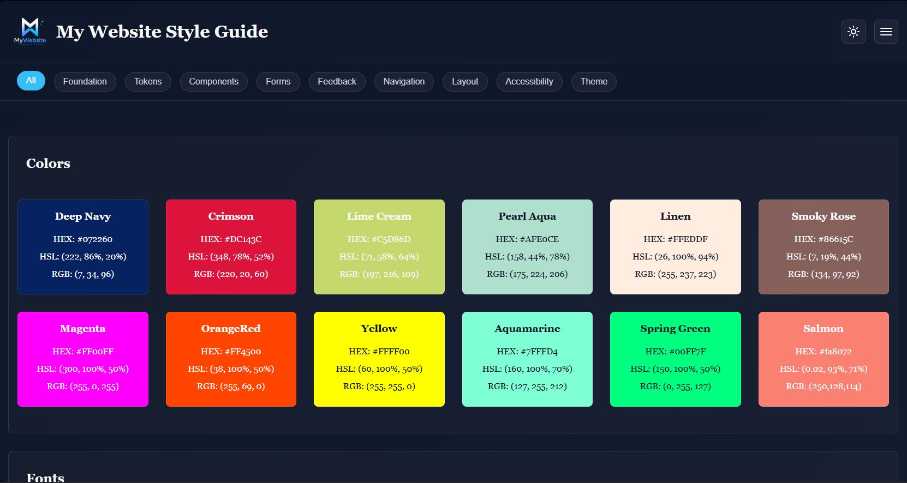

# Website Design System

[](https://amirabenameur3.github.io/Website_Design_System/)



---

## 📸 Preview

A personal **website style guide** showcasing reusable design elements including color palettes, typography, text styles, and button components.

This project was built to practice creating a **consistent design system** for future web projects.

---

## 🌐 Live Demo

https://amirabenameur3.github.io/Website_Design_System/

---

## 🛠 Technologies Used

- HTML5  
- CSS3  
- CSS Variables  
- Flexbox  
- CSS Grid  
- Responsive Design  
- Google Fonts  

---

## ✨ Features

- Color palette system with HEX, RGB, and HSL values  
- Typography showcase with multiple web fonts  
- Structured text style hierarchy (H1, H2, H3, paragraph)  
- Button component examples:
  - Classic button
  - Flat button
  - Skeuomorphic button  
- Responsive layout for desktop, tablet, and mobile screens  
- Dark UI theme

---

## 💡 Skills Practiced

- Building a **design system**
- Organizing reusable CSS components
- Using **CSS variables for theme management**
- Implementing **Flexbox and Grid layouts**
- Creating **interactive UI elements**
- Responsive design techniques

---

## 📁 Project Structure

```
Website_Design
│
├── index.html
├── README.md
│
├── css
│   └── styles.css
│
└── docs
    └── design-system-preview.png
```

---

## 👩‍💻 Author

**Amira Ben Ameur**

PhD researcher & Front-End development learner  

GitHub:  
https://github.com/amirabenameur3
