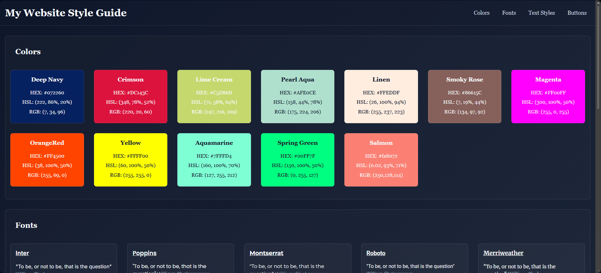

<p align="center">
  
</p>

<h1 align="center">🎨 Website Design System</h1>

<p align="center">
  A reusable design system that showcases color palettes, typography styles, and UI components
  to maintain consistent web design across projects.
</p>

<p align="center">
  
  
  
  
</p>

<p align="center">
  
  
</p>

<p align="center">
  <a href="https://amirabenameur3.github.io/Website_Design_System/">
  
  </a>
</p>

---

## 📖 Project Overview

This project is a **website design system** created to define reusable design guidelines for web development.

It centralizes important visual elements such as:

- Color palettes
- Typography styles
- UI components
- Layout guidelines

The goal of the project is to build a **consistent visual foundation that can be reused across multiple websites and applications.**

Design systems are widely used in modern web development to **maintain visual consistency, improve development efficiency, and simplify UI design workflows.**

---

## ✨ Features

- Organized **color palette system**
- Defined **typography hierarchy**
- Reusable **UI components**
- Consistent **design guidelines**
- Clean and readable layout
- Responsive design

---

# 🎨 Design Sections

The design system is structured into several sections:

### Color Palette
Defines the main colors used across the interface.

### Typography
Demonstrates font styles, sizes, and text hierarchy.

### UI Components
Reusable components such as buttons and cards.

### Layout Guidelines
Examples of spacing and visual structure.

---

## 🎬 Demo

<p align="center">
  
</p>

---

## 🧰 Technologies Used

- **HTML5**
- **CSS3**
- **Flexbox**
- **Responsive Design**
- **Google Fonts**

---

## 📁 Project Structure

```
Website_Design_System
│
├── index.html
├── README.md
├── design_system_favicon.ico
│
├── css
│   └── styles.css
│
└── docs
    ├── Webpage_design_preview.png
    └── demo.gif
```

---

## 👩‍💻 Author

**Amira Ben Ameur**

PhD researcher & Front-End development learner  

GitHub:  
https://github.com/amirabenameur3

---

## ⭐ If you like the project

Give the repository a **star on GitHub** ⭐
